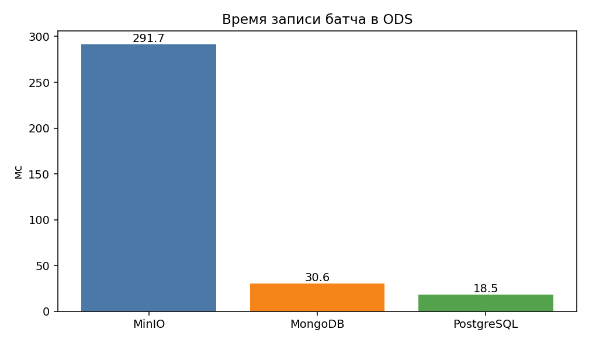
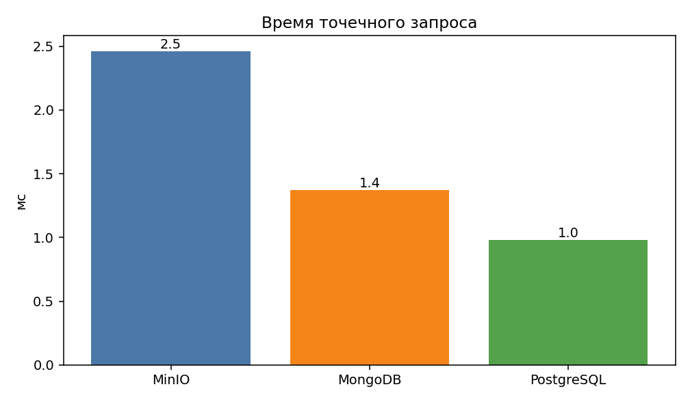
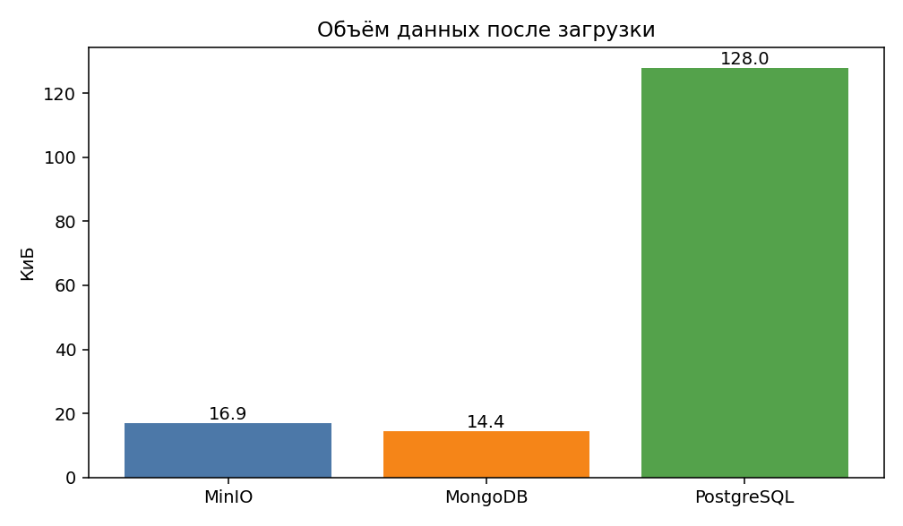

# Сравнение хранилищ

- Дата: 2026-10-02 20:07
- Откуда батч: сохранённый файл `output/matches.jsonl` (сайт в этот момент не открылся)
- Тендеров: **19**
- Проверочный id: `93722966`

| Хранилище | Запись, мс | Запрос по id, мс | Объём, КиБ | Объектов/строк |
|---|---:|---:|---:|---:|
| MinIO | 291.70 | 2.46 | 16.9 | 2 |
| MongoDB | 30.56 | 1.37 | 14.4 | 19 |
| PostgreSQL | 18.47 | 0.98 | 128.0 | 19 |

128 КиБ у PostgreSQL — размер таблиц вместе с пустыми страницами, не размер самих строк. У MinIO и MongoDB цифра ближе к объёму данных.

После загрузки: 19 документов в MongoDB, 19 строк с городами и 19 строк с ценами в PostgreSQL. У тендера `93722966` цена 300000, город Коломна. В MinIO лежат `rss.xml` и `category.html`.

## Графики

